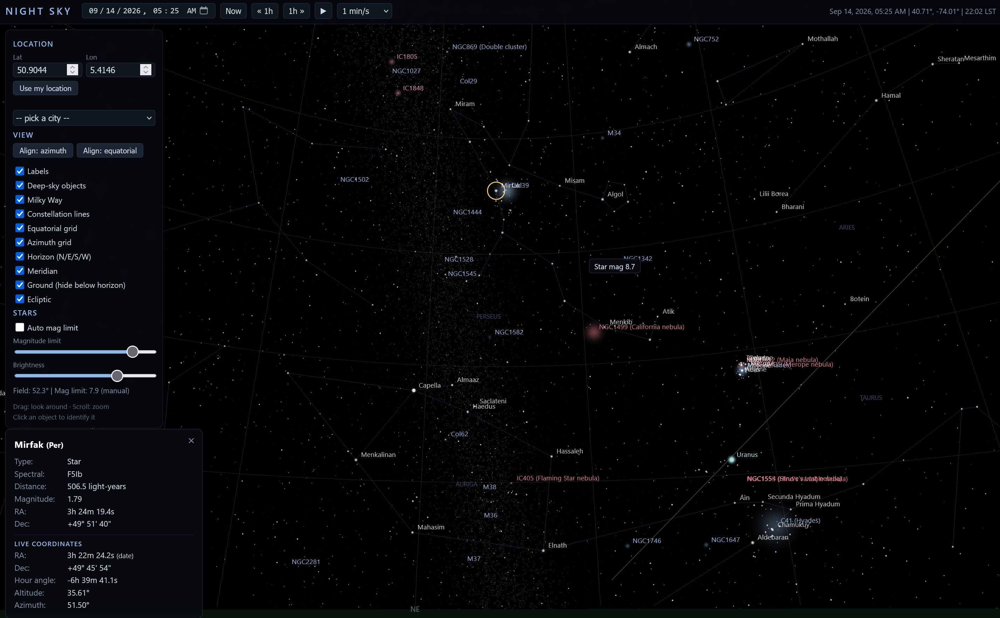

# Night Sky — Interactive Planetarium

A self-contained, offline web application that renders an accurate, interactive
representation of the night sky in your browser. No installation, no build
step, no internet connection required after setup — just open `index.html`.

## LIVE demo

[Night Sky](https://jurgenkobierczynski.com/night-sky/index.html)

## Screenshot



---

## Features

### Sky rendering
- **83,480 stars down to magnitude 9.0** from the HYG star catalog, with
  realistic black-body colors derived from each star's B−V color index.
- **430 named stars** with labels (Sirius, Betelgeuse, Aldebaran, …).
- **536 deep-sky objects**: nebulae, open and globular clusters, galaxies and
  planetary nebulae (all Messier objects of sufficient brightness plus NGC/IC
  entries), rendered as soft colored blobs scaled by their true angular size.
- **Solar system**: Sun, Moon and all planets from Mercury to Pluto, computed
  topocentrically (observer location, aberration, precession, lunar parallax)
  with real magnitudes and lunar illumination phase.
- **Procedural Milky Way** band (~100k points) with bulge and brightness
  gradient toward the galactic center.
- **Constellation lines** for all 88 constellations, with constellation name
  labels that fade in appropriately at each zoom level.

### Navigation & view control
- Drag to look around, scroll to zoom (70° down to 0.5° field of view),
  touch/pinch supported.
- **View frame modes**:
  - *Align: equatorial* — the view is locked to the stars; the horizon turns
    past as time passes (classic star-chart behavior).
  - *Align: azimuth* — the view is locked to the horizon; the zenith stays up
    and the stars drift through the frame as the Earth turns.
- **Roll alignment**: one click squares the screen up with the active grid
  (zenith up in azimuth mode, celestial pole up in equatorial mode).

### Time control
- Date/time picker, "Now" button, ±1 hour steps.
- Play/pause with speeds from real time up to **1 day per second**.

### Location
- Manual latitude/longitude input.
- Built-in city list (~48 major cities worldwide).
- **Device geolocation** via the browser's location permission — coordinates
  never leave your machine.

### Coordinate grids & horizon
- **Equatorial grid**: RA meridians every 1h, Dec parallels every 10°.
- **Azimuth grid**: altitude circles every 10°, azimuth spokes every 15°,
  oriented to your location and rotating in real time with sidereal time.
- **Horizon line** with N/NE/E/SE/S/SW/W/NW cardinal labels.
- **Meridian**: the local north–south great circle through the zenith.
- **Ground option**: hides and clips everything below the horizon and fills
  the region with a subtle dark-green ground dome.

### Magnitude & brightness
- **Auto magnitude limit** (default 5.0) deepens automatically as you zoom in.
- **Manual magnitude limit** slider (1–9) to override the auto behavior.
- **Brightness slider** (0.3×–5×) scales star size and intensity; the Milky
  Way responds at half strength so it never blows out.

### Object identification
- Hover any object for a tooltip; click for the full info panel:
  - Stars: name, constellation, spectral type, distance, magnitude.
  - Deep-sky objects: designation, type, constellation, magnitude, size.
  - Solar system bodies: distance (AU), magnitude, Moon illumination %.
- **Live coordinates** for the selected object, updating in real time:
  - RA and Dec (of date, topocentric)
  - Local **hour angle**
  - **Altitude** and **Azimuth** (with a below-horizon flag)
- **Local sidereal time (LST)** is shown in the top bar for easy verification
  against any almanac.

---

## Usage

Open `index.html` in any modern browser (Chrome, Edge, Firefox). Everything
runs locally — the only optional network use is the browser geolocation
permission prompt, which you control.

| Control | Action |
|---|---|
| Drag | Look around |
| Scroll / pinch | Zoom (field of view 70° → 0.5°) |
| Click | Identify object |
| Hover | Quick tooltip |

## Project structure

```
night-sky/
├── index.html            Entry point
├── app.js                Application logic (rendering, math, UI)
├── style.css             Styles
├── libs/
│   ├── three.min.js      three.js r128 (WebGL rendering)
│   └── astronomy.min.js  astronomy-engine 2.1.19 (ephemeris math)
├── data/
│   ├── stars_data.js     Star catalog (binary, base64-packed)
│   ├── dso_data.js       Deep-sky object catalog
│   ├── const_data.js     Constellation lines & names
│   └── *_raw.*           Original catalogs (for rebuilding)
└── tools/
    ├── build_data.ps1    Rebuilds star/DSO data from the raw catalogs
    └── build_const.js    Rebuilds constellation line data
```

## Data sources & libraries

- **Star catalog**: [HYG Database](https://github.com/astronexus/HYG-Database)
  (v4.1) — stars to magnitude 9.0, CC BY-SA 4.0.
- **Deep-sky objects**: DSO catalog from the
  [HYG Database](https://github.com/astronexus/HYG-Database) repository.
- **Constellation lines & names**:
  [d3-celestial](https://github.com/ofrohn/d3-celestial) by Olaf Frohn.
- **[three.js](https://threejs.org)** r128 — MIT License.
- **[astronomy-engine](https://github.com/cosinekitty/astronomy)** 2.1.19 by
  Don Cross — MIT License.

## Development

To modify the catalogs, edit `tools/build_data.ps1` (stars/DSOs) or
`tools/build_const.js` (constellation lines) and re-run them with the raw
files in `data/`; they regenerate the packed `*_data.js` files.

## Credits & acknowledgements

- **Built with [GLM-5.3-Flash](https://z.ai)** (Z.ai), driven through the
  opencode CLI agent — the entire application, data pipeline, and this
  document were produced in an iterative human–AI pairing session.
- **Total model cost: $1.30**
- Thanks to the maintainers of the HYG database, d3-celestial, three.js and
  astronomy-engine for making their work freely available.

## License

This project is licensed under the **GNU General Public License v3.0** —
see the [LICENSE](LICENSE) file or
[gnu.org/licenses/gpl-3.0](https://www.gnu.org/licenses/gpl-3.0.html).

> This program is distributed in the hope that it will be useful, but WITHOUT
> ANY WARRANTY; without even the implied warranty of MERCHANTABILITY or
> FITNESS FOR A PARTICULAR PURPOSE. See the GNU General Public License for
> more details.
